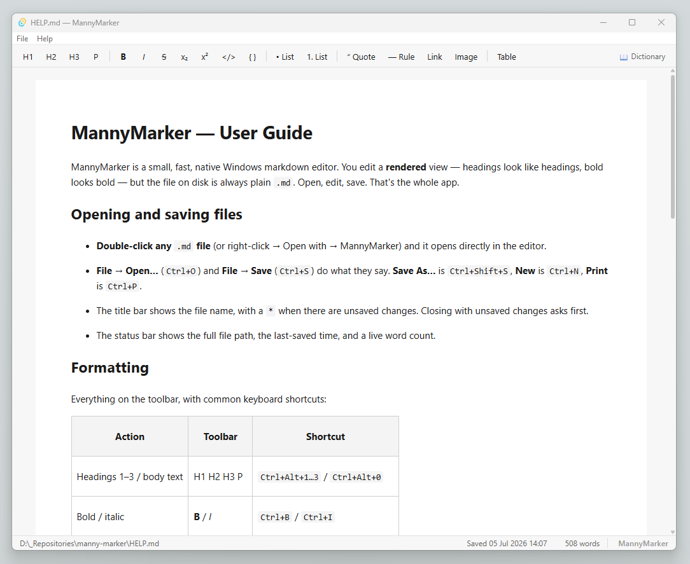

# MannyMarker

[](https://github.com/PaulCoughlin/mannymarker/blob/main/HELP.md)
[](https://github.com/PaulCoughlin/mannymarker/actions/workflows/ci.yml)

A small, fast, native Windows markdown editor. You edit a **rendered** view —
headings look like headings, bold looks bold — but the file on disk is always
plain `.md`. No server, no browser tab, no terminal. In the spirit of
[Typora](https://typora.io/), deliberately kept minimal: open, edit, save.



## Stack

- **Tauri 2** (Rust shell + WebView2 frontend) — small binary, fast launch,
  native window/menu/dialogs. Uses the already-installed Edge WebView2.
- **TipTap** (on ProseMirror) — the rendered-document WYSIWYG surface.
- **Vite + vanilla TypeScript** — no UI framework; leanest for a single window.
- Markdown ⇄ document translation is provided by [`tiptap-markdown`](https://github.com/aguingand/tiptap-markdown).

## Project layout

```
tauri-editor/
  src/                  frontend TS — editor, commands, state, context menu, prefs
    editor.ts           TipTap instance; enabled extensions = the fixed vocabulary
    commands.ts         toolbar + shortcut actions (bold, headings, lists, …)
    state.ts            document lifecycle: path, dirty state, open/save flows
    contextmenu.ts      right-click menu (table ops inside a table)
    preferences.ts      font/size/spellcheck/page width, persisted to JSON
  src-tauri/
    src/lib.rs          Rust shell: window, native menu, read/write/mtime commands
    tauri.conf.json     window config, productName, CSP
    capabilities/       Tauri permission scopes (fs/dialog/window)
  tests/                Vitest round-trip fidelity tests
  index.html, styles.css
docs/superpowers/specs/ design docs (Tauri editor, preferences, tables)
```

## Build & run

Requires the **Rust toolchain** and **Node.js**.

```bash
cd tauri-editor
npm install
npm run tauri dev
```

On Windows there is a one-shot build helper that closes any running instance,
builds the release binary, and offers to launch it:

```powershell
cd tauri-editor
./compile.ps1
```
For my personal use, but included, a compile-local.ps1 which compiles the standalone, without MSI/NSIS installers, and drops a copy of the exe into "C:\Portable\Manny Marker\" (configurable)

```powershell
cd tauri-editor
./compile-local.ps1
```

## Test

```bash
cd tauri-editor
npm test
```

Round-trip tests (Vitest + jsdom) assert markdown → TipTap doc → markdown
fidelity with **exact** string matching across the full vocabulary.

## Package (release .exe)

```bash
cd tauri-editor
npm run tauri build
```

Produces `MannyMarker.exe` under `src-tauri/target/release/`. The portable exe
is ~8–9 MB and runs on any Windows 11 machine with Edge WebView2 installed
(standard on Windows 11).

## Supported markdown

Headings (H1–H6), bold / italic / bold-italic, strikethrough, subscript
(`~x~`) & superscript (`^x^`), ordered & unordered lists (nested), inline code
and fenced code blocks, links, inline images (remote and base64 `data:` URIs),
blockquotes (nested), horizontal rules, tables with column alignment
(`:---` / `:---:` / `---:`, preserved on save), paragraphs.

**Inline HTML exceptions.** Raw HTML passthrough is part of official markdown,
and GitHub-flavored files routinely use it (GFM has no sub/sup syntax at all).
Tags that map onto the vocabulary are parsed and saved back as native markdown
syntax: `<sub>`, `<sup>`, `<b>`, `<strong>`, `<i>`, `<em>`, `<s>`, `<del>`,
`<code>`, `<br>`. All other HTML stays visible as literal text — honest about
what a save preserves.

## How this app came about

MannyMarker began as a **WPF + C#** editor (`RichTextBox` over a
`FlowDocument`, with a hand-written `FlowDocument ⇄ Markdown` serializer —
that code is preserved in the original
[md-editor-win](https://github.com/PaulCoughlin/md-editor-win) repository at the
`wpf-legacy` tag). It worked, but in
practice it was too heavy: a ~150 MB self-contained single-file exe, ~1.5 s
warm launch, and a window move/resize that felt jerky.

Testing showed the same feature set could be delivered **smaller and faster**
with Tauri: an ~8.6 MB binary, ~0.55 s warm launch (~3× faster than WPF), and
smooth OS-drawn window movement. The markdown serializer — the bulk of the
WPF effort — is replaced by `tiptap-markdown`, locked in by round-trip tests.
Once built and debugged, the app was renamed to **Manny Marker**, which is the
final editor. See
[`docs/superpowers/specs/2026-07-03-tauri-tiptap-editor-design.md`](docs/superpowers/specs/2026-07-03-tauri-tiptap-editor-design.md)
for the full design and the measured comparisons.

The original design brief for the WPF app survives in [`SPEC.md`](SPEC.md)
(marked superseded), kept as historical context.
